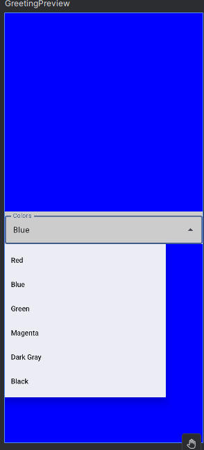

# In-Class 5 - Color Selector (with ViewModel!)



## Make the Menu
We are extending what we did in the original Color Selector app by adding a ViewModel to hold 
and mutate the state. You can work off your implementation of the Color Selector, or use my 
version as the basis.

## Create `data class ColorSelectorUiState` to store the state
If we examine the original version of the Color Selector, we can pick out which parts we want to 
include in the state. We will probably want to have the string for the current color in the 
state, since it is displayed in the drop-down menu. 

Along side that, we could also say the 
actual current color is part of the state. There are multiple approaches actually, we could 
include the color inside of the state, or we could have a method in the ViewModel which takes a 
string and returns the corresponding color. 

A third part of the state could also be whether the menu is currently expanded/open. I am going 
to put all of these into the state, as it will give me some flexibility if I want to modify things.

## Create a DataSource
So we can tie together the string for the name of the color to the actual color, I'm going to 
create a map of <String, Color>. This will do a couple things for me. First, I can directly use 
the string of the current color to get the actual color. Second, I can get a list of just the 
keys, and use that list to populate the menu entries. I could use something like `when` or 
`if/else` statements, but then I would need to have a list with just the strings as well as the 
`when` to get the colors. The map lets me do it all in one place.

## Create the ViewModel
1. First, we need to add the ViewModel library components to our Android Studio project. Open the 
file `build.gradle.kts (Module: app)`. You don't want the `build.gradle.kts` in the root 
directory, but the one in the `app` directory. Scroll down and add into the `dependencies` block: 
```
    implementation("androidx.lifecycle:lifecycle-viewmodel-compose-android:2.8.7")
```

2. Next create a new Kotlin class/file called `ColorSelectorViewModel`, and have it extend from 
   ViewModel.
```
import androidx.lifecycle.ViewModel

class CharacterCreatorViewModel : ViewModel() {
}
```

3. Add a private state variable as a `MutableStateFlow`
```
import kotlinx.coroutimes.flow.MutableStateFlow

// UI state
private val _uiState = MutablseStateFlow(ColorSelectorUiState())
```

4. Add a public variable 'uiState` so our UI can access a read-only version of the state 
```
val uiState: StateFlow<CharacterCreatorUiState> = _uiState.asStateFlow()
```

5. Add methods the UI can use to update the state. We need to be able to set and toggle the 
   state of the `expanded` variable. We also need to update the current color string, and along 
   with it the corrent color itself.

6. In `MainActivity.kt`, pass a `ColorSelectorViewModel` into our top level composable with a 
   default value of `viewModel()`. Get the state from the `ViewModel`. This is the public 
   `uiState` we're allowed to access. Use the `collectAtState()` method. Using this method is 
   what triggers recomposition of anything that uses the state each time the state is updated.
```
val colorSelectorUiState by colorSelectorViewModel.uiState.collectAsState()
```
7. Use the current state and the `ViewModel` methods to now display and update the current color.

## Custom Colors
Now that we now have the state and app logic inside the ViewModel, let's see what else we can do.
Inside the `ViewModel`, add methods to update the red, blue, and green components of the current 
color. We can also have these methods update the current color string to something like 
`"Custom"`. Back in `MainActivity.kt`, add three `Slider`s to update the colors manually.
