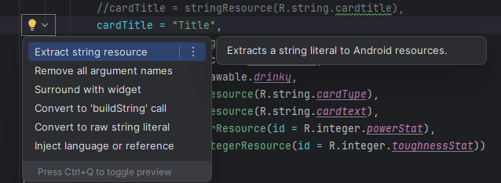
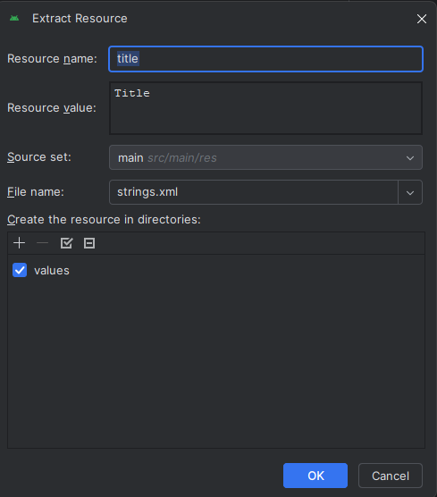
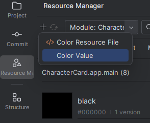
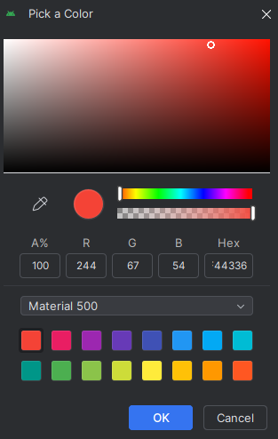

# Project 0 - Character Card

### Learning Objectives
- Become familiar with the Android Studio programming environment
- Apply basic hierarchical layout concepts to arrange GUI components

### Overview
For Project 0, we will be using Android Studio to make an app that shows a character card, similar to cards for Magic: the Gathering or Pokemon TCG. We will use hierarchical containers to arrange the elements on the screen. Your app will contain both text and images, as well as any other visuals you wish to add. 

### Program Operation
You are free to add to these requirements, but app should consist of at least 3 or 4 `@Composable` functions. You can name them whatever makes sense, but here are some suggestions:

1. `CardImage` - this function is the top level of your app, and will call your other functions or built-in composable functions such as `Image`. Since these all appear vertically, you will want to use a `Column` to arrange everything.

2. `TitleCost` - in the preview below, this function is where the top text bar that has "Drinkyelf" and 5 followed by a warning triangle. The name (Drinkyelf) and cost (5) are two separate text elements. They are both inside a `Row` element. They are placed in opposite ends of the `Row` by using the `horizontalArrangement = Arrangement.SpaceBetween` parameter for `Row`

3. `CardType` - below the image, there is a text element similar to the title text at the top. You may simply re-use the `TitleCost` function, or create a new one.

4. `CardTextStats` - the large text box at the bottom contains two text elements arranged in a `Column`. The `3/2` are two separate numbers, `3` represents the character power and `2` the character toughness. The two text elements should appear in opposite corners. For example, you can place the main text in the upper-left of the box, and the character stats in the bottom-right (or you can do upper-right and bottom-left).

In addition to those elements, you will have an image for your character, in the example below the image is placed in between the `TitleCost` and `CardType` elements.

None of the text, numbers, or background color in the app should be hard-coded. To accomplish this, you will use the Resource Manager to store these values. If you want to temporarily write them into your code feel free to do so. In Android Studio, if you hover over a string a light bulb should appear. When you click the light bulb, there is a menu that gives you the option to `Extract string resource` like below:

.

Clicking that opens a menu where you can set the name and value. 



This saves it to `strings.xml`. To create a background color resource, under the Resource Manager there is a tab for `Color` next to `Drawable`. You add a color by clicking the + and selecting `Color Value`



This opens a menu similar to setting the string resource name and value. Give the color a name like `backgroundColor` and click the eye dropper next to `Resource Value`. Here you can either select a pre-set color near the bottom of the window or manually make your own.



 You can make the numbers be `Integer` resources, but you will have to add them manually, similar to how you added a new color.  When you then get an integer resource, similar to getting string resource, you need to call 
```integerResource(id = R.integer.powerStat)```
to get the value. 

Some other things to try are putting borders around the elements and adding padding around and inside elements. Borders and padding can be set by using the `modifier` parameter, like

```
modifier = Modifier
    .padding(start = 8.dp)
    .border(BorderStroke(1.dp, Color.Black))
```

This would give `8` pixels of padding to the `start` of the element, typically the left, and add a `1` pixel black border. 

### Example of App Preview


### Turn-in and Grading

To turn-in your project, first take a screenshot of your app, either from the preview window, emulator, or physical device. Place that image and your Android Studio project folder into a zip file, and upload that to Pilot. This project is worth 25 points, disrtibuted as follows:

| Task | Points |
|-|-|
| App contains at least 3 text blocks (described above as `TitleCost`, `CardType`, and `CardTextStats`) | 5 |
| App contains at least one image | 5 |
|`TitleCost` contains at least 2 text elements with one arranged to the left and the other to the right of the text box | 5 |
| `CardTextStats` contains at least 2 text elements with one aligned to opposite corners of the text box (e.g. one is in the upper-left and one is in the bottom-right) | 5 |
| Resources such as strings and integers are not hard-coded, instead they are saved in XML files | 5 | 


