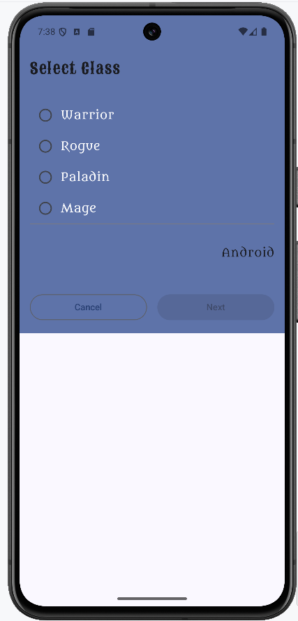
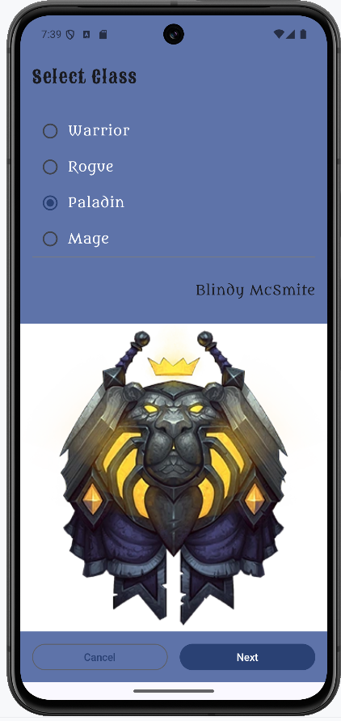
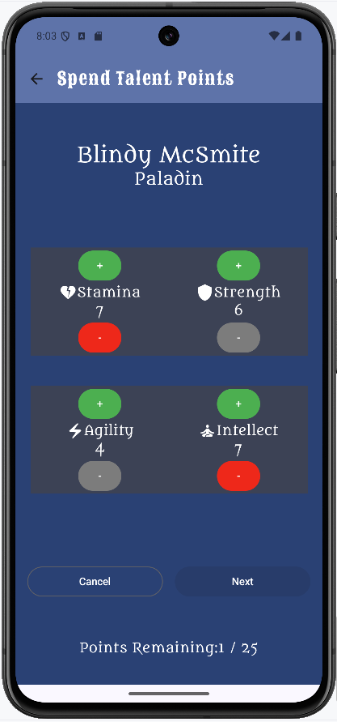

# Project 04 - Character Creator Deluxe

## Overview

For this project, we're going to continue integrate Project 01, the Character Card, into the Character Creator app. The user will select from a list of pre-made characters and spend talent points. Those options will drive what appears on the card. The app will comprise of three screens: Select Class, Spend Talent Points, and Character Card, so we will need to add navigation features.

I recommend beginning with a new, blank Android Studio project. Then, make three separate files, one for each screen. You will likely have files named:

1. `SelectClassScreen.kt`
2. `SpendTalentsScreen.kt`
3. `CharacterCardScreen.kt`

You can copy parts of your previous projects into the three files for the screens. I recommend copying in individual composable functions and making sure they work in the preview. I would not copy entire files, as the package names will likely be wrong and cause problems later.

The main screen navigation control should stay in `MainActivity.kt`. On each screen, you also want to hae some way to navigate, such as a Next button and a `Cancel` or `Back` button. These will use callback functions that will be passed into the composable from `MainActivity` in order to handle events.

## Select Class Screen

The first screen is the class selection screen. You should have a way for the user to select one and only one pre-made character. For instance, radio buttons are a good option. You could also use a drop-down menu like we had for the Color Chooser app.

When the class is selected, you should display an image for the character as well as a character name.

## Spend Talent Points Screen

Once the user selects a character, the next screen will let them spend talent points. This screen does most of what our previous Character Creator iterations did. You'll still have some stats that the user can add or remove points from, as well as a maximum number of points to spend. For this
project, you also want to have the talent points begin with some default amounts based on which class was chosen.

In my implementation, I made the character base stats be the floor, and the user could not make any stat go lower than the pre-made character's base values. You can have it work however you want, but you still need to make sure the values don't drop below zero and the sum of the stats doesn't go beyond some maximum.

## Character Summary Screen

The last screen displays the character card with the fields filled out according to which character was selected and how the points were spent. For my card, I put the character name and cost in the bar at the top. The cost is calculated based off the input stats. Then the image for the class below that. Underneath is the class name, and I added an icon for each class.

In the bottom text box, I put a special ability for each character based on their class, and at the bottom is `power/toughness` which are calculated based off the input stats.

This is optional, but I also had a color and icon associated with each class. On the character card, the class color is the background color, and the icon appears in the character class bar.

## Navigation

To navigate through the app, you will use the `NavHost` to set up routes and the `NavController` to navigate to the desination screen. We did this in class with the Cupcake app, you can also go to this [codelab](https://developer.android.com/codelabs/basic-android-kotlin-compose-navigation?continue=https%3A%2F%2Fdeveloper.android.com%2Fcourses%2Fpathways%2Fandroid-basics-compose-unit-4-pathway-2%23codelab-https%3A%2F%2Fdeveloper.android.com%2Fcodelabs%2Fbasic-android-kotlin-compose-navigation#2) which shows the steps for building the Cupcake app.

## Add Extra Elements

In addition to the navigation, you will add at least **one** additional feature of your choosing. You are free to add something you think is interesting, or you can work on some of these suggestions:

1. [Material Theming](https://developer.android.com/codelabs/basic-android-kotlin-compose-material-theming?continue=https%3A%2F%2Fdeveloper.android.com%2Fcourses%2Fpathways%2Fandroid-basics-compose-unit-3-pathway-3%23codelab-https%3A%2F%2Fdeveloper.android.com%2Fcodelabs%2Fbasic-android-kotlin-compose-material-theming#0)

2. Character image for each option

3. Buttons change color when available

4. Top app bar with text and/or image/icon for each screen

5. Navigate to next screen automatically when user selects class or finishes spending points, with    option to go back

6. [Swipe](https://developer.android.com/develop/ui/compose/touch-input/pointer-input/drag-swipe-fling) to go to next/previous screen

If you have other ideas and want to make sure it's sufficient, just ask me.

## Grading

Zip your entire Android studio project folder and upload it to the corresponding Dropbox in Pilot for this assignment. You **must** implement the app using Jetpack Compose, otherwise you will receive zero points for the assignmnet. This project is worth 25 points, distributed as follows:

| Task                                                                                  | Points |
|---------------------------------------------------------------------------------------|--------|
| Screen 1 - Select a pre-made character                                                | 5      |
| Screen 2 - Spend talent points, works the same as in Project 3                        | 5      |
| Screen 3 - Show Character Card with fields based on chosen character and spent points | 5      |
| Can navigate from 1 -> 2 -> 3, also cancel/back                                       | 5      |
| Extra element (discussed above)                                                       | 5      |